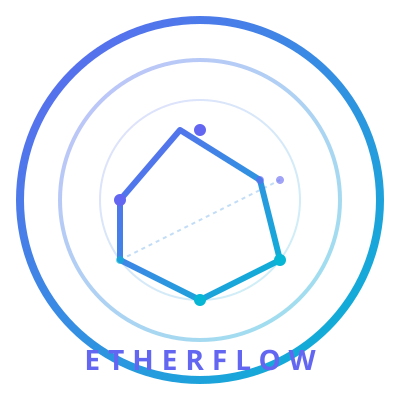

<p align="center">
  
</p>

<h1 align="center">EtherFlow</h1>

<p align="center">
  <strong>A lightweight, high-performance Reactive Web Framework for Java, Kotlin, Python, .NET, iOS, JS, Flutter & Kotlin Multiplatform built from scratch.</strong>
</p>

<p align="center">
  <a href="https://github.com/kvarun701/EtherFLow/actions"></a>
  <a href="https://central.sonatype.com/"></a>
  <a href="https://opensource.org/licenses/MIT"></a>
</p>

<p align="center">
  <a href="https://render.com/deploy?repo=https://github.com/kvarun701/EtherFLow"></a>
</p>

EtherFlow is a from-scratch implementation of a reactive web framework inspired by Spring WebFlux. It provides a lightweight, highly efficient `Mono`/`Flux` reactive implementation, a functional `RouterFunction` DSL for HTTP endpoints, JSON serialization via Jackson, and a zero-dependency Netty server adapter — all without pulling in the Spring Framework or any heavy dependency trees.

---

## Key Features & Unique Selling Points

*   ⚡ **Custom Reactive Engine** — A complete from-scratch implementation of the Reactive Streams specification with custom, high-performance `Mono` and `Flux` publishers, and multiple asynchronous `Schedulers`.
*   🚀 **Zero-Dependency Netty Core** — Build embedded web servers on Netty with a tiny package footprint (~2MB JAR size) and sub-100ms startup times (no Spring context, no reflection magic, no XML).
*   🎯 **Functional Routing DSL** — A powerful, type-safe functional DSL (`RouterFunction` builder + `HandlerFunction` + `RequestPredicate`) for web endpoints and filter pipelines.
*   📡 **Multiplatform HTTP Client** — Includes a Kotlin Multiplatform `HttpClient` with fluent APIs returning `Mono<T>`, built-in retries, multipart upload, streaming support, and local file I/O that runs seamlessly across JVM, Android, iOS, and JS.
*   🐍 **Python API Calling Feature (Flask & FastAPI)** — High-performance reactive clients (`PythonApiClient`, `FlaskApiClient`, `FastApiClient`) returning `Mono<T>` for seamless, asynchronous interop with Python Flask API and FastAPI backends.
*   🔷 **.NET Framework & Web API Calling Feature** — Specialized reactive client (`DotNetApiClient`) returning `Mono<T>` for non-blocking communication with ASP.NET Core and .NET Framework Web APIs.
*   📦 **Full Core Capabilities**:
    *   **Reactive Streams SPI** — Full implementation of `Publisher`, `Subscriber`, `Subscription`, and `Processor` interfaces.
    *   **Operator Suite** — Rich functional operator chains: `map`, `flatMap`, `filter`, `switchIfEmpty`, `then`, `thenReturn`, `subscribeOn`, `publishOn`, `block`, etc.
    *   **Scheduler Pool** — Pre-configured thread pools: `parallel()`, `single()`, `boundedElastic()`, `timer()`, and `immediate()`.
    *   **Jackson-based Codecs** — Built-in JSON serialization/deserialization via `HttpMessageReader` and `HttpMessageWriter`.
    *   **Front Controller Pattern** — Built with a native `DispatcherHandler`, `HandlerMapping`, and `HandlerAdapter` architecture.
    *   **Filter Pipeline** — Native support for `WebFilter` and `WebExceptionHandler` chains.
    *   **Modern Language Integration** — Fully optimized for Java 21+ features (sealed interfaces, pattern matching, records) and Kotlin.

---

## Why EtherFlow is the Best Library in the World

EtherFlow isn't just another reactive library; it is a meticulously crafted, ultra-lightweight, and zero-dependency ecosystem built from the ground up to solve modern multi-platform web engineering challenges:

*   🌐 **Universal Code Portability (write once, call everywhere):** Call APIs with the exact same codebase on Java, Android Java, Kotlin, iOS (Swift), Browser JS, and Node.js. 
*   ⚡ **Mind-Blowing Performance:** With sub-100ms startup times, a minimal ~2MB footprint, and zero dependency trees (no Spring overhead), it represents the pinnacle of microservice and edge runtime efficiency.
*   🔒 **Zero Reflection, Proxies, or Magic:** Call stacks are 100% transparent. No runtime reflection tricks, no Spring container instantiation, and no proxy-based AOP traps. If there's an error, you see the exact line of code that threw it.
*   🚀 **Bridges Any Concurrency Model Natively:** Maps seamlessly to Java Reactive Streams (`Mono`/`Flux`), Kotlin Coroutines (`suspend`/`Flow`), Swift Concurrency (`async`/`await`), and JavaScript Promises.
*   📦 **Virtual Threads First:** Simple scheduling lets you use Java 21 Virtual Threads directly with `Schedulers.immediate()`, achieving massive concurrency without pool configuration complexity.

---

## Why EtherFlow over Spring WebFlux?

| Aspect | Spring WebFlux | EtherFlow |
|--------|---------------|-----------|
| **Dependencies** | Spring Context, Spring AOP, Spring Beans, Spring Web, Reactor Core, Reactor Netty, Jackson — hundreds of classes | Only Jackson + Netty |
| **Startup time** | 2-5 seconds (context scanning) | < 100ms |
| **JAR size** | ~15-20 MB | ~2 MB |
| **Complexity** | Deep class hierarchy, proxy-based AOP, 15+ annotations | Minimal interfaces, no proxies, no reflection magic |
| **Learning curve** | Must understand DI, AOP, Bean lifecycle, autoconfiguration | Just Mono/Flux and RouterFunction |
| **Debugging** | Proxy chains, nested contexts, complex stack traces | Straightforward call stacks |
| **Control** | Framework dictates architecture via IoC | You control every component manually or via simple composition |
| **Virtual threads** | Works but adds another layer of complexity | Clean — just use `Schedulers.immediate()` on virtual threads |
| **Kotlin** | Works but reactive types clash with coroutines | Pure Java types — no coroutine conflicts |
| **Android** | WebFlux doesn't run on Android | `etherflow-client` module uses OkHttp — works on Android natively |
| **HTTP Client** | WebClient tied to Reactor Netty | `HttpClient` uses OkHttp, returns `Mono<T>` — same types as server |

### When to pick EtherFlow instead of WebFlux

- You want a **minimal, understandable** reactive stack
- You're building a **gateway, proxy, or embedded server** where startup time and footprint matter
- You want **full control** without framework magic
- You're **learning** reactive programming and want to see how the pieces fit
- You need reactive HTTP for a **CLI tool, agent, or edge service**
- You want a **Kotlin-friendly** reactive stack without coroutine complexity

### When to stick with Spring WebFlux

- You need the **whole Spring ecosystem** (Security, Data R2DBC, Cloud, Actuator)
- Your team is already deeply invested in Spring patterns (DI, AOP, autoconfiguration)
- You need battle-tested enterprise features (distributed tracing, bulkhead, circuit breaker)

---

## Architecture

```
┌─────────────────────────────────────────────┐
│  Functional Endpoints                        │
│  RouterFunction → HandlerFunction            │
│  RequestPredicate (path, method, headers)    │
└──────────────────┬──────────────────────────┘
                   │
┌──────────────────▼──────────────────────────┐
│  DispatcherHandler (Front Controller)        │
│  HandlerMapping → HandlerAdapter             │
│  WebFilter → WebExceptionHandler             │
└──────────────────┬──────────────────────────┘
                   │
┌──────────────────▼──────────────────────────┐
│  HttpHandler (Server Abstraction)            │
│  ServerWebExchange                           │
│  ServerHttpRequest / ServerHttpResponse      │
└──────────────────┬──────────────────────────┘
                   │
┌──────────────────▼──────────────────────────┐
│  Codec Layer                                 │
│  HttpMessageReader / HttpMessageWriter       │
│  JacksonCodec (JSON)                         │
└──────────────────┬──────────────────────────┘
                   │
┌──────────────────▼──────────────────────────┐
│  Reactive Core                               │
│  Mono<T> / Flux<T> + Schedulers              │
│  Reactive Streams SPI (Publisher/Subscriber) │
└─────────────────────────────────────────────┘
```

---

## Quick Start

### Build from source

**Maven:**
```bash
git clone https://github.com/kvarun701/EtherFLow.git
cd EtherFlow
mvn install -DskipTests
```

**Gradle:**
```bash
git clone https://github.com/kvarun701/EtherFLow.git
cd EtherFlow
./gradlew jar
```

### Add the dependency

To use this library (especially in Android/Gradle projects), make sure **`mavenCentral()`** is added to your repositories block:

**Gradle (Kotlin / Groovy DSL):**
```groovy
repositories {
    mavenCentral()
}
```

**Maven:**
```xml
<dependency>
    <groupId>io.github.kvarun701</groupId>
    <artifactId>etherflow-starter-webflux</artifactId>
    <version>0.1.1</version>
    <type>pom</type>
</dependency>
```

**Gradle (Kotlin DSL):**
```kotlin
implementation("io.github.kvarun701:etherflow-starter-webflux:0.1.1")
```

**Gradle (Groovy DSL):**
```groovy
implementation 'io.github.kvarun701:etherflow-starter-webflux:0.1.1'
```

### Run the sample

**Maven:**
```bash
mvn exec:java -pl etherflow-sample
mvn package -pl etherflow-sample -DskipTests
java -jar etherflow-sample/target/etherflow-sample-0.1.1.jar
```

**Gradle:**
```bash
./gradlew :etherflow-sample:run
./gradlew :etherflow-sample:jar
java -jar etherflow-sample/build/libs/etherflow-sample-0.1.1.jar
```

### Hello World in 30 seconds

**Core Server Setup (Only 5 Lines):**
```java
// 1. Define functional endpoints
RouterFunction routes = RouterFunction.route()
    .GET("/hello", req -> Mono.just(ServerResponse.ok("Hello EtherFlow!")))
    .build();

// 2. Configure dispatcher mappings & adapters (fluent API)
DispatcherHandler handler = new DispatcherHandler()
    .addHandlerMapping(new RouterFunctionMapping(routes))
    .addHandlerAdapter(new RouterFunctionMapping(routes));

// 3. Start the Netty server on port 8080
new NettyServer(8080, handler).start();
```

---

#### Complete Runnable Examples:

**Java:**
```java
import io.etherflow.core.Mono;
import io.etherflow.server.netty.NettyServer;
import io.etherflow.web.DispatcherHandler;
import io.etherflow.web.function.*;

public class App {
    public static void main(String[] args) throws Exception {
        RouterFunction routes = RouterFunction.route()
                .GET("/hello", req -> Mono.just(ServerResponse.ok("Hello EtherFlow!")))
                .build();

        DispatcherHandler dispatcher = new DispatcherHandler()
                .addHandlerMapping(new RouterFunctionMapping(routes))
                .addHandlerAdapter(new RouterFunctionMapping(routes));

        NettyServer server = new NettyServer(8080, dispatcher);
        server.start();
        System.out.println("Server running on http://localhost:8080");
        server.await();
    }
}
```

**Kotlin:**
```kotlin
import io.etherflow.core.Mono
import io.etherflow.server.netty.NettyServer
import io.etherflow.web.DispatcherHandler
import io.etherflow.web.function.*

fun main() {
    val routes = RouterFunction.route()
        .GET("/hello") { Mono.just(ServerResponse.ok("Hello EtherFlow!")) }
        .build()

    val dispatcher = DispatcherHandler()
        .addHandlerMapping(RouterFunctionMapping(routes))
        .addHandlerAdapter(RouterFunctionMapping(routes))

    val server = NettyServer(8080, dispatcher)
    server.start()
    println("Server running on http://localhost:8080")
    server.await()
}
```

---

## Building a REST API with Kotlin

EtherFlow works seamlessly with Kotlin's idiomatic features: data classes, lambda syntax, reified generics, and extension functions.

### Domain model with data classes

```kotlin
@JvmInline
value class TaskId(val value: String)

data class Task(
    val id: TaskId,
    val title: String,
    val completed: Boolean = false
)
```

### Handler with idiomatic Kotlin

```kotlin
import io.etherflow.core.Mono
import io.etherflow.web.function.*

class TaskHandler {
    private val tasks = mutableMapOf<String, Task>()

    fun listTasks(request: ServerRequest): Mono<ServerResponse> =
        Mono.just(ServerResponse.ok(tasks.values.toList()))

    fun getTask(request: ServerRequest): Mono<ServerResponse> {
        val id = request.pathVariable("id")
        return tasks[id]?.let {
            Mono.just(ServerResponse.ok(it))
        } ?: Mono.just(ServerResponse.notFound())
    }

    fun createTask(request: ServerRequest): Mono<ServerResponse> =
        request.bodyTo<Task>().flatMap { task ->
            tasks[task.id.value] = task
            Mono.just(ServerResponse.created().body(task))
        }
}
```

The `bodyTo<T>()` call uses a Kotlin inline reified extension — no class token needed.

### Route definition with trailing lambda

```kotlin
val routes = RouterFunction.route()
    .GET("/tasks") { handler.listTasks(it) }
    .GET("/tasks/{id}") { handler.getTask(it) }
    .POST("/tasks") { handler.createTask(it) }
    .build()
```

### Full runnable Kotlin app

```kotlin
import io.etherflow.core.Mono
import io.etherflow.server.netty.NettyServer
import io.etherflow.web.DispatcherHandler
import io.etherflow.web.function.*

data class Task(val id: String, val title: String, val completed: Boolean = false)

fun main() {
    val tasks = mutableMapOf<String, Task>()

    val routes = RouterFunction.route()
        .GET("/tasks") { Mono.just(ServerResponse.ok(tasks.values.toList())) }
        .GET("/tasks/{id}") { req ->
            val task = tasks[req.pathVariable("id")]
            if (task != null) Mono.just(ServerResponse.ok(task))
            else Mono.just(ServerResponse.notFound())
        }
        .POST("/tasks") { req ->
            req.bodyTo<Task>().flatMap { task ->
                tasks[task.id] = task
                Mono.just(ServerResponse.created().body(task))
            }
        }
        .build()

    val dispatcher = DispatcherHandler()
    dispatcher.addHandlerMapping(RouterFunctionMapping(routes))
    dispatcher.addHandlerAdapter(RouterFunctionMapping(routes))

    val server = NettyServer(8080, dispatcher)
    server.start()
    println("Task API running on http://localhost:8080")
    server.await()
}
```

---

## Kotlin Spring Boot Starter

Use EtherFlow as your reactive web runtime in a Kotlin Spring Boot application.

### Add the dependency

**Maven:**
```xml
<dependency>
    <groupId>io.github.kvarun701</groupId>
    <artifactId>etherflow-spring-boot-starter</artifactId>
    <version>0.1.1</version>
    <type>pom</type>
</dependency>
```

**Gradle (Kotlin DSL):**
```kotlin
implementation("io.github.kvarun701:etherflow-spring-boot-starter:0.1.1")
```

**Gradle (Groovy DSL):**
```groovy
implementation 'io.github.kvarun701:etherflow-spring-boot-starter:0.1.1'
```

### Full Kotlin Spring Boot app

```kotlin
package com.example

import io.etherflow.core.Mono
import io.etherflow.web.function.RouterFunction
import io.etherflow.web.function.ServerResponse
import org.springframework.boot.autoconfigure.SpringBootApplication
import org.springframework.boot.runApplication
import org.springframework.context.annotation.Bean

@SpringBootApplication
class TaskApplication {

    @Bean
    fun taskRoutes(): RouterFunction = RouterFunction.route()
        .GET("/hello") { Mono.just(ServerResponse.ok("Hello from Kotlin + EtherFlow!")) }
        .build()
}

fun main(args: Array<String>) {
    runApplication<TaskApplication>(*args)
}
```

### Route definitions with `@Bean` functions

```kotlin
@Bean
fun userRoutes(handler: UserHandler): RouterFunction = RouterFunction.route()
    .GET("/users") { handler.listUsers() }
    .GET("/users/{id}") { handler.getUser(it) }
    .POST("/users") { handler.createUser(it) }
    .build()

@Bean
fun taskRoutes(handler: TaskHandler): RouterFunction = RouterFunction.route()
    .GET("/tasks") { handler.listTasks() }
    .POST("/tasks") { handler.createTask(it) }
    .build()
```

### Configuration

```properties
# application.properties
etherflow.port=8080
```

EtherFlow auto-configuration collects all `RouterFunction` beans, wires them into a `DispatcherHandler`, and starts the Netty server — zero manual setup.

---

## Reactive HTTP Client

Call REST APIs from Android, CLI tools, or server-side apps using EtherFlow's `HttpClient` — the same `Mono`/`Flux` types you use on the server, now on the client side. Zero Spring dependency, OkHttp transport, built-in retry and caching.

### Add the dependency

**Maven:**
```xml
<dependency>
    <groupId>io.github.kvarun701</groupId>
    <artifactId>etherflow-client</artifactId>
    <version>0.1.1</version>
</dependency>
```

**Gradle (Kotlin DSL):**
```kotlin
implementation("io.github.kvarun701:etherflow-client:0.1.1")
```

**Gradle (Groovy DSL):**
```groovy
implementation 'io.github.kvarun701:etherflow-client:0.1.1'
```

### Usage

```java
import io.etherflow.client.*;
import io.etherflow.core.Mono;

public class ApiExample {
    record User(String id, String name, String email) {}

    public static void main(String[] args) {
        HttpClient client = HttpClient.builder()
            .baseUrl("https://jsonplaceholder.typicode.com")
            .retry(3)
            .cache(java.time.Duration.ofMinutes(5), 100)
            .build();

        // GET with path variable — returns Mono, subscribe to execute
        Mono<User> user = client.get()
            .uri("/users/{id}", 1)
            .retrieve()
            .bodyTo(User.class);

        // GET returning a list via ParameterizedTypeReference
        Mono<List<User>> users = client.get()
            .uri("/users")
            .retrieve()
            .bodyTo(new ParameterizedTypeReference<List<User>>() {});

        // POST with JSON body
        User newUser = new User(null, "Alice", "alice@example.com");
        Mono<User> created = client.post()
            .uri("/users")
            .body(newUser)
            .retrieve()
            .bodyTo(User.class);

        // Safe error handling — never throws
        Mono<Result<User>> safe = client.get()
            .uri("/users/{id}", 999)
            .retrieve()
            .toResult(User.class);

        // Block for testing / non-reactive code
        User result = user.block();
    }
}
```

### Kotlin extension functions

The `etherflow-client` module ships with built-in Kotlin reified extensions:

```kotlin
import io.etherflow.client.*

data class User(val id: String?, val name: String, val email: String)

fun main() {
    val client = HttpClient.builder()
        .baseUrl("https://jsonplaceholder.typicode.com")
        .retry(3)
        .cache(Duration.ofMinutes(5), 100)
        .build()

    // Reified type — no Class token needed
    val user: Mono<User> = client.get()
        .uri("/users/{id}", 1)
        .retrieve()
        .bodyTo<User>()

    // List with reified generics
    val users: Mono<List<User>> = client.get()
        .uri("/users")
        .retrieve()
        .bodyTo<List<User>>()

    // POST with body
    val created: Mono<User> = client.post()
        .uri("/users")
        .body(User(null, "Alice", "alice@example.com"))
        .retrieve()
        .bodyTo<User>()

    // Safe result — never throws
    val safe: Mono<Result<User>> = client.get()
        .uri("/users/{id}", 999)
        .retrieve()
        .toResult<User>()

}

### 🐍 Calling Python APIs (Flask API & FastAPI Integration)

EtherFlow provides dedicated, high-performance reactive client abstractions (`PythonApiClient`, `FlaskApiClient`, and `FastApiClient`) designed for calling Python web microservices asynchronously. It handles non-blocking JSON request/response pipelines, path parameter substitution, body serialization, and health monitoring for both **Flask API** and **FastAPI** backends.

```
┌─────────────────────────────────────────────────────────────┐
│                 EtherFlow Reactive App                      │
│      (Netty / DispatcherHandler / Mono / Flux)              │
└──────────────┬───────────────────────────────┬──────────────┘
               │                               │
    PythonApiClient.flask()         PythonApiClient.fastApi()
               │                               │
               ▼                               ▼
┌──────────────────────────────┐ ┌─────────────────────────────┐
│    Python Flask REST API     │ │    Python FastAPI Server    │
│    http://localhost:5001     │ │    http://localhost:5002    │
└──────────────────────────────┘ └─────────────────────────────┘
```

#### 🏗️ Python Architecture: Creating APIs & Calling Third-Party APIs

When implementing Python backend services (Flask or FastAPI), the standard enterprise architecture divides responsibilities into **Controllers/Routes**, **Integration Services**, and **Data Models**:

```
┌───────────────────────────────────────────────────────────────────┐
│                    Client / EtherFlow Gateway                     │
└─────────────────────────────────┬─────────────────────────────────┘
                                  │ HTTP Request
                                  ▼
┌───────────────────────────────────────────────────────────────────┐
│               Python Web API (Flask or FastAPI)                   │
│   ┌───────────────────────────────────────────────────────────┐   │
│   │ 1. Controller / Route Layer (@app.route / @app.get)       │   │
│   └─────────────────────────────┬─────────────────────────────┘   │
│                                 │ Invokes                         │
│   ┌─────────────────────────────▼─────────────────────────────┐   │
│   │ 2. Service Layer (SyncThirdPartyService / AsyncService)   │   │
│   └─────────────────────────────┬─────────────────────────────┘   │
└─────────────────────────────────┼─────────────────────────────────┘
                                  │ HTTP Call (requests / httpx)
                                  ▼
┌───────────────────────────────────────────────────────────────────┐
│                     External Third-Party API                      │
│             (e.g., Weather API, Payment Gateway, Payment)         │
└───────────────────────────────────────────────────────────────────┘
```

##### Creating APIs & Calling Third-Party APIs in Flask (`requests`)

```python
from flask import Flask, jsonify, request
import requests

app = Flask(__name__)

# 1. API Creation: Define Flask route
@app.route('/api/flask/external-user/<int:user_id>', methods=['GET'])
def get_external_user(user_id):
    # 2. Third-Party API Call using 'requests' library
    url = f"https://jsonplaceholder.typicode.com/users/{user_id}"
    try:
        response = requests.get(url, timeout=5)
        response.raise_for_status()
        external_data = response.json()
        
        # 3. Return enriched JSON response
        return jsonify({
            "status": "success",
            "source": "Flask -> Third-Party API",
            "user": {
                "id": external_data.get("id"),
                "name": external_data.get("name"),
                "email": external_data.get("email")
            }
        }), 200
    except requests.exceptions.RequestException as err:
        return jsonify({"status": "error", "message": str(err)}), 500
```

##### Creating APIs & Calling Third-Party APIs in FastAPI (`httpx`)

```python
from fastapi import FastAPI, Query
from pydantic import BaseModel
import httpx

app = FastAPI(title="FastAPI Third-Party API Service")

# 1. Data Model Schema
class AnalyticsEvent(BaseModel):
    event_name: str
    data: dict

# 2. Async API Creation & Third-Party Integration using 'httpx'
@app.post("/api/fastapi/external-event", status_code=201)
async def post_third_party_event(event: AnalyticsEvent):
    url = "https://jsonplaceholder.typicode.com/posts"
    async with httpx.AsyncClient(timeout=5) as client:
        res = await client.post(url, json=event.dict())
        res.raise_for_status()
        
        return {
            "status": "success",
            "source": "FastAPI -> Third-Party Webhook",
            "remoteResponse": res.json()
        }
```

#### 1. Java Example: Unified Python API Client

```java
import io.etherflow.client.python.*;
import io.etherflow.core.Mono;
import java.util.Map;

public class PythonIntegrationExample {
    public static void main(String[] args) {
        // Create unified Python API client for Flask (5001) & FastAPI (5002)
        PythonApiClient pythonClient = PythonApiClient.builder()
                .flaskUrl("http://localhost:5001")
                .fastApiUrl("http://localhost:5002")
                .build();

        // 1. Call Flask GET endpoint — returns Mono<Map>
        Mono<Map> flaskGreeting = pythonClient.flask()
                .get("/api/flask/hello?name=Alice", Map.class);

        // 2. Call Flask POST model prediction endpoint
        Map<String, Object> payload = Map.of("inputs", java.util.List.of(10, 20, 30));
        Mono<Map> flaskPrediction = pythonClient.flask()
                .post("/api/flask/predict", payload, Map.class);

        // 3. Call FastAPI GET endpoint
        Mono<Map> fastApiItem = pythonClient.fastApi()
                .get("/api/fastapi/items/42", Map.class);

        // 4. Call FastAPI POST dataset analysis endpoint
        Map<String, Object> analysisReq = Map.of("dataset_name", "Sales2026", "metrics", java.util.List.of(1.5, 3.2, 4.8));
        Mono<Map> fastApiAnalysis = pythonClient.fastApi()
                .post("/api/fastapi/analyze", analysisReq, Map.class);

        // 5. Reactive health check aggregating Flask & FastAPI statuses
        Mono<Map<String, Object>> health = pythonClient.checkHealth();
    }
}
```

#### 2. Kotlin Example: Idiomatic Functional Usage

```kotlin
import io.etherflow.client.python.PythonApiClient
import io.etherflow.client.python.FlaskApiClient
import io.etherflow.client.python.FastApiClient

fun main() {
    val pythonClient = PythonApiClient.builder()
        .flaskUrl("http://localhost:5001")
        .fastApiUrl("http://localhost:5002")
        .build()

    // Non-blocking reactive calls returning Mono
    val flaskRes = pythonClient.callFlaskGet("/api/flask/hello?name=Kotlin", Map::class.java)
    val fastRes  = pythonClient.callFastApiGet("/api/fastapi/items/100", Map::class.java)

    // Aggregate health check across both Python services
    pythonClient.checkHealth().subscribe { status ->
        println("Combined Python Services Status: ${status["overallStatus"]}")
    }
}
```

#### 3. Dedicated Flask & FastAPI Clients

For microservices targeting a single Python backend:

```java
// Dedicated Flask API client
FlaskApiClient flaskClient = FlaskApiClient.create("http://localhost:5001");
Mono<Map> user = flaskClient.get("/api/flask/users/100", Map.class);

// Dedicated FastAPI client
FastApiClient fastApiClient = FastApiClient.create("http://localhost:5002");
Mono<Map> item = fastApiClient.get("/api/fastapi/items/200", Map.class);
```

#### 4. Running Python API Backends

EtherFlow provides sample Python API services in the `python-servers/` directory:

```bash
# Option A: Standard Flask & FastAPI (requires pip dependencies)
pip install -r python-servers/requirements.txt
python python-servers/start_python_apis.py

# Option B: Zero-dependency standalone Python mock server (uses standard library only)
python python-servers/mock_python_apis.py
```

#### 5. Runnable Gateway Sample App

Run the included API Gateway sample demonstrating EtherFlow bridging Netty with Flask & FastAPI:

```bash
mvn exec:java -pl etherflow-sample -Dexec.mainClass="io.etherflow.sample.PythonApiSample"
```

### 🔷 Calling .NET Web APIs (ASP.NET Core & .NET Framework)

EtherFlow includes a dedicated reactive client abstraction (`DotNetApiClient`) designed specifically for calling .NET Framework and ASP.NET Core Web APIs asynchronously. It handles non-blocking JSON request/response pipelines, path parameter substitution, body serialization, and health monitoring for .NET microservices.

```
┌─────────────────────────────────────────────────────────────┐
│                 EtherFlow Reactive App                      │
│      (Netty / DispatcherHandler / Mono / Flux)              │
└──────────────────────────────┬──────────────────────────────┘
                               │
                      DotNetApiClient.get()
                               │
                               ▼
┌─────────────────────────────────────────────────────────────┐
│             .NET Framework / ASP.NET Core Web API           │
│                    http://localhost:5003                    │
└─────────────────────────────────────────────────────────────┘
```

#### 1. Java Example: Calling .NET Web API

```java
import io.etherflow.client.dotnet.DotNetApiClient;
import io.etherflow.core.Mono;
import java.util.Map;
import java.util.List;

public class DotNetIntegrationExample {
    public static void main(String[] args) {
        // Create client for .NET Web API server (defaulting to port 5003)
        DotNetApiClient dotNetClient = DotNetApiClient.create("http://localhost:5003");

        // 1. Call GET hello endpoint — returns Mono<Map>
        Mono<Map> greeting = dotNetClient.get("/api/dotnet/hello?name=EnterpriseUser", Map.class);

        // 2. Call GET product by ID endpoint
        Mono<Map> product = dotNetClient.get("/api/dotnet/products/99", Map.class);

        // 3. Call POST endpoint with JSON body payload
        Map<String, Object> body = Map.of("taskName", "BatchProcessing", "data", List.of(1, 2, 3, 4));
        Mono<Map> result = dotNetClient.post("/api/dotnet/process", body, Map.class);

        // 4. Reactive health check for .NET service
        Mono<Map<String, Object>> health = dotNetClient.health();
    }
}
```

#### 2. Kotlin Example: Idiomatic Usage

```kotlin
import io.etherflow.client.dotnet.DotNetApiClient

fun main() {
    val client = DotNetApiClient.create("http://localhost:5003")

    // Async reactive call returning Mono<Map>
    client.get("/api/dotnet/hello?name=KotlinUser", Map::class.java).subscribe { response ->
        println("Greeting from .NET: ${response["greeting"]}")
    }

    // Health check
    client.health().subscribe { health ->
        println(".NET Health: ${health["status"]}")
    }
}
```

#### 3. Running .NET API Backends

EtherFlow provides .NET API server implementations in the `dotnet-servers/` directory:

```bash
# Option A: Standard ASP.NET Core Web API (requires .NET SDK)
dotnet run --project dotnet-servers/DotNetApi.csproj

# Option B: Zero-dependency standalone Python mock server simulating .NET API on port 5003
python dotnet-servers/dotnet_api_mock.py
```

#### 4. Runnable .NET Gateway Sample App

Run the included .NET API sample app demonstrating EtherFlow bridging Netty with .NET Web API:

```bash
mvn exec:java -pl etherflow-sample -Dexec.mainClass="io.etherflow.sample.DotNetApiSample"
```

### Why this beats Retrofit

| Retrofit | EtherFlow HttpClient |
|----------|---------------------|
| Interface proxy + annotation parsing at runtime | Fluent programmatic API — no reflection |
| Requires boilerplate interface definitions | No interfaces, just method chains |
| Multiple adapters (RxJava, coroutines) | Built-in Mono/Flux — same types as the server |
| Error callbacks via `Call` | Mono error channel + `toResult()` for safe handling |
| No built-in retry | `retry(3)` with exponential backoff |
| No built-in caching | `cache(Duration.ofMinutes(5), 100)` — in-memory TTL cache |
| Hard to customize per request | Interceptors per client |
| No streaming | `bodyToFlux()` for streaming responses |
| Type erasure for generics | `ParameterizedTypeReference` + Kotlin reified |

---

## Android Studio

Use `etherflow-client` as your HTTP client in Android apps — same `Mono<T>` reactive types, no Retrofit/RxJava boilerplate.

### 1. Add the dependency

**`build.gradle.kts` (Module: app):**
```kotlin
dependencies {
    implementation("io.github.kvarun701:etherflow-client:0.1.1")
}
```

**`build.gradle` (Groovy):**
```groovy
dependencies {
    implementation 'io.github.kvarun701:etherflow-client:0.1.1'
}
```

### 2. Add INTERNET permission

**`AndroidManifest.xml`:**
```xml
<uses-permission android:name="android.permission.INTERNET" />
```

For local development against `http://10.0.2.2` (Android emulator → host), add a network security config:

**`res/xml/network_security_config.xml`:**
```xml
<?xml version="1.0" encoding="utf-8"?>
<network-security-config>
    <domain-config cleartextTrafficPermitted="true">
        <domain includeSubdomains="true">10.0.2.2</domain>
    </domain-config>
</network-security-config>
```

Reference it in `AndroidManifest.xml`:
```xml
<application
    android:networkSecurityConfig="@xml/network_security_config"
    ...>
```

### 3. Kotlin — ViewModel + Activity example

```kotlin
// UserRepository.kt
class UserRepository {
    private val client = HttpClient.builder()
        .baseUrl("https://jsonplaceholder.typicode.com")
        .retry(3)
        .cache(Duration.ofMinutes(5), 100)
        .build()

    fun getUser(id: String): Mono<User> = client.get()
        .uri("/users/{id}", id)
        .retrieve()
        .bodyTo<User>()

    fun getUsers(): Mono<List<User>> = client.get()
        .uri("/users")
        .retrieve()
        .bodyTo<List<User>>()
}

// UserViewModel.kt
class UserViewModel : ViewModel() {
    private val repository = UserRepository()
    private val _user = MutableLiveData<User?>()
    val user: LiveData<User?> = _user
    private val _error = MutableLiveData<String?>()
    val error: LiveData<String?> = _error

    fun loadUser(id: String) {
        repository.getUser(id).subscribe(
            { user -> _user.postValue(user) },
            { e -> _error.postValue(e.message) }
        )
    }
}

// MainActivity.kt
class MainActivity : AppCompatActivity() {
    private val viewModel: UserViewModel by viewModels()

    override fun onCreate(savedInstanceState: Bundle?) {
        super.onCreate(savedInstanceState)
        viewModel.user.observe(this) { user ->
            if (user != null) binding.nameText.text = user.name
        }
        viewModel.error.observe(this) { msg ->
            if (msg != null) Toast.makeText(this, msg, Toast.LENGTH_LONG).show()
        }
        viewModel.loadUser("1")
    }
}
```

### 4. Java — AsyncTask / Executor example

```java
// UserRepository.java
public class UserRepository {
    private final HttpClient client = HttpClient.builder()
        .baseUrl("https://jsonplaceholder.typicode.com")
        .retry(3)
        .build();

    public Mono<User> getUser(String id) {
        return client.get()
            .uri("/users/{id}", id)
            .retrieve()
            .bodyTo(User.class);
    }
}

// MainActivity.java
public class MainActivity extends AppCompatActivity {
    private TextView nameText;
    private UserRepository repository = new UserRepository();

    @Override
    protected void onCreate(Bundle savedInstanceState) {
        super.onCreate(savedInstanceState);
        setContentView(R.layout.activity_main);
        nameText = findViewById(R.id.nameText);

        repository.getUser("1").subscribe(
            user -> runOnUiThread(() -> nameText.setText(user.getName())),
            e -> runOnUiThread(() -> Toast.makeText(this, e.getMessage(), Toast.LENGTH_LONG).show())
        );
    }
}
```

> `Mono.subscribe()` is non-blocking — OkHttp performs the network call on its own thread pool. The response arrives asynchronously via the `onNext`/`onError` callbacks. Use `runOnUiThread()` or `postValue()` to update the UI on Android's main thread.

### 5. Retrofit → EtherFlow migration

**Retrofit (before):**
```kotlin
interface Api {
    @GET("users/{id}")
    fun getUser(@Path("id") String id): Call<User>

    @POST("users")
    fun createUser(@Body User user): Call<User>
}

// Usage with callbacks
val call = api.getUser("1")
call.enqueue(object : Callback<User> {
    override fun onResponse(call: Call<User>, response: Response<User>) {
        if (response.isSuccessful) {
            val user = response.body()
            // update UI
        }
    }
    override fun onFailure(call: Call<User>, t: Throwable) {
        // handle error
    }
})
```

**EtherFlow (after):**
```kotlin
val client = HttpClient.builder()
    .baseUrl("https://api.example.com")
    .retry(3)
    .build()

// Same API — just method chains, no interface
val user: Mono<User> = client.get()
    .uri("/users/{id}", 1)
    .retrieve()
    .bodyTo<User>()

user.subscribe(
    { user -> viewModel.user.postValue(user) },
    { e -> viewModel.error.postValue(e.message) }
)

// POST with body — fluent, no @Body annotation
val created: Mono<User> = client.post()
    .uri("/users")
    .body(User(null, "Alice", "alice@example.com"))
    .retrieve()
    .bodyTo<User>()
```

### 6. ProGuard / R8 rules

If you enable minification, add these rules to `proguard-rules.pro`:

```
# EtherFlow Client
-keep class io.etherflow.** { *; }

# Jackson
-keep class com.fasterxml.** { *; }
-keepattributes *Annotation*, Signature, Exception
-keepclassmembers class * {
    @com.fasterxml.jackson.annotation.* <fields>;
}
-dontwarn com.fasterxml.**
```

---

## Kotlin Multiplatform (KMP) — Ktor-like API

The `etherflow-client-kmp` module provides a **Ktor-inspired DSL** for Kotlin Multiplatform projects. Write API calls using `suspend` functions and `kotlinx.serialization` — works on JVM, Android, iOS, and JS/browser.

### Add the dependency

**`build.gradle.kts`:**
```kotlin
implementation("io.github.kvarun701:etherflow-client-kmp:0.1.1")
```

### Create a client

```kotlin
import io.etherflow.client.kmp.*
import kotlinx.serialization.Serializable

@Serializable
data class User(val id: Int, val name: String, val email: String)

val client = httpClient {
    baseUrl = "https://jsonplaceholder.typicode.com"
    retryCount = 3
    connectTimeout = 10.seconds
}
client.install(platformEngine()) // OkHttp on JVM/Android
```

### GET with path variables

```kotlin
// Ktor-like: get("url/{id}", arg) → body {} or bodyAs<T>()
val response: HttpResponse = client.get("/users/{id}", 1).body()
println(response.statusCode) // 200

// Auto-deserialize to data class using kotlinx.serialization
val user: User = client.get("/users/{id}", 1).bodyAs<User>()
println(user.name)
```

### POST with JSON body

```kotlin
val created = client.post("/users").body(User(0, "Alice", "alice@example.com"))
```

### PUT / DELETE

```kotlin
client.put("/users/{id}", 1).body(User(1, "Bob", "bob@example.com"))
client.delete("/users/{id}", 1).body()
```

### Headers, auth, content-type

```kotlin
val admin: List<User> = client.get("/admin/users")
    .bearerAuth(token)
    .header("X-Request-ID", uuid)
    .bodyAs<List<User>>()
```

### Multipart upload

```kotlin
client.post("/upload")
    .multipart {
        field("user", "bob")
        field("description", "my profile photo")
        file("avatar", "photo.jpg", bytes, "image/jpeg")
    }
    .body()
```

### Binary download (image, file, etc.)

```kotlin
// Raw bytes
val bytes: ByteArray = client.get("/image.png").bodyAsBytes()

// Save directly to file (JVM / iOS)
val size: Long = client.get("/large-file.zip").downloadTo("/tmp/output.zip")

// Access on response directly
val response = client.get("/photo.jpg").body()
val data: ByteArray = response.bodyAsBytes
val len: Long = response.contentLength

// Video / large file streaming
val streamed = client.get("/video.mp4").stream()
streamed.chunks.collect { chunk ->
    // process each 8KB chunk without buffering the whole file
}

// WebSocket
val ws = client.webSocket("wss://echo.example.com")
ws.send("Hello")
ws.incoming.collect { msg ->
    when (msg) {
        is WebSocketMessage.Text -> println(msg.text)
        is WebSocketMessage.Binary -> println("binary: ${msg.data.size} bytes")
    }
}
ws.close()
```

### Android ViewModel with KMP client

```kotlin
class UserViewModel : ViewModel() {
    private val client = httpClient {
        baseUrl = "https://api.example.com"
        retryCount = 2
    }.apply { install(platformEngine()) }

    private val _user = MutableStateFlow<User?>(null)
    val user: StateFlow<User?> = _user

    fun loadUser(id: String) {
        viewModelScope.launch {
            val result = try {
                client.get("/users/{id}", id).bodyAs<User>()
            } catch (e: Exception) {
                null
            }
            _user.value = result
        }
    }
}
```

### KMP targets & features (all ship in `etherflow-client-kmp`)

| Target | Engine | JSON | Multipart | Download | Streaming | WebSocket |
|--------|--------|------|-----------|----------|-----------|-----------|
| JVM Desktop | OkHttp | ✅ | ✅ | ✅ `FileOutputStream` | ✅ 8 KB chunks | ✅ `OkHttpWebSocket` |
| Android | OkHttp (from jvmMain) | ✅ | ✅ | ✅ `FileOutputStream` | ✅ 8 KB chunks | ✅ `OkHttpWebSocket` |
| iOS (x64, arm64, simulator) | NSURLSession | ✅ | ✅ | ✅ `NSData.writeToFile` | ⏳ fallback | ✅ `NSURLSessionWebSocketTask` |
| JS (IR browser) | `window.fetch` | ✅ | ✅ | ❌ browser sandbox | ✅ `ReadableStream` | ✅ Browser `WebSocket` |

### Java-friendly API

The KMP client is fully callable from Java. Non-reified overloads (`bodyJson`, `bodyText`, `bodyBytes`, `execute`) are provided for Java interoperability.

```java
import io.etherflow.client.kmp.*;

// Create client (engine installed via Kotlin platformHttpClient() or directly)
HttpClient client = new HttpClient(new HttpClientConfig());

// GET — execute() returns HttpResponse
HttpResponse response = client.get("https://api.example.com/users/{id}", 1)
    .bearerAuth("token123")
    .execute();

int status = response.getStatusCode();
String body = response.getBodyAsString();

// POST with raw JSON string
HttpResponse created = client.post("https://api.example.com/users")
    .bodyJson("{\"name\":\"Alice\",\"email\":\"alice@example.com\"}")
    .execute();

// Binary download
byte[] image = client.get("/image.png").bodyAsBytes();
long size = client.get("/file.zip").downloadTo("/tmp/output.zip");
```

---

### Compose Multiplatform (Android, iOS, Desktop, Web)

The `etherflow-client-compose` module provides Compose-friendly helpers for reactive HTTP — no manual `LaunchedEffect` boilerplate.

**Add the dependency:**
```kotlin
implementation("io.github.kvarun701:etherflow-client-compose:0.1.1")
```

**Basic usage:**
```kotlin
@Composable
fun UserProfile(userId: String) {
    val client = rememberHttpClient {
        baseUrl = "https://api.example.com"
        retryCount = 2
    }

    val userState = httpGetAs(client, "/users/{id}", userId, serializer = User.serializer())

    when (val state = userState.value) {
        is HttpRequestState.Loading -> CircularProgressIndicator()
        is HttpRequestState.Success -> Text("Hello, ${state.data.name}")
        is HttpRequestState.Error -> Text("Error: ${state.exception.message}")
    }
}
```

**POST with JSON body:**
```kotlin
@Composable
fun CreateUserForm() {
    val client = rememberHttpClient()
    val result = httpPostAs(
        client = client,
        url = "/users",
        serializer = User.serializer()
    ) {
        bodyJson("""{"name":"Alice","email":"alice@example.com"}""")
    }

    // result.value == Loading / Success(user) / Error(e)
}
```

**Custom request state (any suspend block):**
```kotlin
@Composable
fun WebSocketMessages(client: HttpClient) {
    val messages = produceHttpState {
        val ws = client.webSocket("wss://echo.example.com")
        val texts = mutableListOf<String>()
        ws.incoming.collect { msg ->
            if (msg is WebSocketMessage.Text) texts.add(msg.text)
        }
        texts
    }

    // messages.value == Loading / Success(list) / Error(e)
}
```

**Available composables in `io.etherflow.client.compose`:**

| Function | Description |
|----------|-------------|
| `rememberHttpClient {}` | Creates and remembers an `HttpClient` with platform engine |
| `produceHttpState(key, fetch)` | Wraps any suspend block into `State<HttpRequestState<T>>` |
| `httpGetAs(client, url, ..., serializer)` | GET + auto-deserialize |
| `httpPostAs(client, url, ..., serializer)` | POST + auto-deserialize |

The `etherflow-client-compose` module compiles for JVM, Android, iOS, and JS/browser.

---

## Client Anatomy Across Platforms

EtherFlow's HTTP Client architecture uses Kotlin Multiplatform (KMP) to write the core logic once and execute it natively on every platform, using the best native engines and language patterns:

| Platform / Framework | Core Engine | Concurrency Model | JSON Serialization | Target Module |
|----------------------|-------------|-------------------|--------------------|---------------|
| **Java (JVM)** | OkHttp | Reactive (`Mono`/`Flux`) | Jackson | `etherflow-client` |
| **Android (Java)** | OkHttp | Reactive (`Mono`/`Flux`) | Jackson | `etherflow-client` |
| **Kotlin (JVM/Android)** | OkHttp | Coroutines (`suspend`/`Flow`) | `kotlinx.serialization` | `etherflow-client-kmp` |
| **iOS (Swift / SwiftUI)** | Darwin (`NSURLSession`) | Swift Concurrency (`async`/`await`) | Swift `JSONDecoder` or `kotlinx` | `etherflow-client-kmp` |
| **Compose Multiplatform** | Platform Native | Compose State (`rememberHttpClient`) | `kotlinx.serialization` | `etherflow-client-compose` |

---

### 1. Java / Android Java (Reactive Mono/Flux API)
On pure Java platforms, EtherFlow provides a familiar reactive builder pattern returning `Mono<T>` types:
```java
// Create Client with OkHttp engine
HttpClient client = HttpClient.builder()
    .baseUrl("https://api.example.com")
    .build();

// Fetch asynchronously using Mono
client.get()
    .uri("/users/{id}", 1)
    .retrieve()
    .bodyTo(User.class)
    .subscribe(
        user -> System.out.println("User: " + user.name()),
        error -> error.printStackTrace()
    );
```

### 2. Kotlin (Ktor-like Coroutines DSL)
On Kotlin-first projects, write clean non-blocking code using `suspend` functions and type-safe `bodyAs<T>()` deserializers:
```kotlin
val client = httpClient {
    baseUrl = "https://api.example.com"
}
client.install(platformEngine()) // OkHttp under the hood

// Coroutine async call
val user: User = client.get("/users/{id}", 1).bodyAs<User>()
```

### 3. iOS (Native Swift & SwiftUI Async/Await)
When compiled to iOS, Kotlin's `suspend` functions bridge automatically to Swift's native `async`/`await`. Requests use Darwin's underlying `NSURLSession` engine:
```swift
import SwiftUI
import EtherFlowClient

class UserViewModel: ObservableObject {
    private let client = HttpClient(config: HttpClientConfig())
    
    init() {
        client.install(engine: Platform_iosKt.platformEngine()) // Darwin engine
    }

    func loadUser() async throws -> User {
        let response = try await client.get(url: "/users/1", pathParams: []).execute()
        return try JSONDecoder().decode(User.self, from: response.bodyAsString.data(using: .utf8)!)
    }
}
```

### 4. Compose Multiplatform (Declarative Compose State)
In Compose Multiplatform (Android, iOS, Desktop, Web), fetch network resource state declaratively inside your UI composables with zero lifecycle boilerplate:
```kotlin
@Composable
fun UserScreen(userId: String) {
    val client = rememberHttpClient { baseUrl = "https://api.example.com" }
    val userState = httpGetAs(client, "/users/{id}", userId, serializer = User.serializer())

    when (val state = userState.value) {
        is HttpRequestState.Loading -> CircularProgressIndicator()
        is HttpRequestState.Success -> Text("Welcome back, ${state.data.name}!")
        is HttpRequestState.Error -> Text("Failed to load user.")
    }
}
```

### 5. JavaScript / Web (Browser Fetch & Kotlin/JS Client)
For JavaScript environments, you can call the EtherFlow API using standard async `fetch` or consume the compiled Kotlin/JS multiplatform module in standard JS/TS projects:

**Option A: Standard Browser JavaScript (`fetch`):**
```javascript
async function fetchUser(userId) {
    const response = await fetch(`https://api.example.com/users/${userId}`, {
        method: 'GET',
        headers: {
            'Accept': 'application/json',
            'X-Client-Platform': 'Browser-JS'
        }
    });
    if (!response.ok) throw new Error(`HTTP error: ${response.status}`);
    return await response.json();
}
```

**Option B: Compiled Kotlin/JS Multiplatform Client:**
Kotlin Multiplatform compiles to Web JS targets natively using the browser's `fetch` engine.
```javascript
import { createHttpClient, platformEngine } from 'etherflow-client-kmp';

const client = createHttpClient();
client.install(platformEngine()); // Installs window.fetch engine

async function loadData() {
    const response = await client.get("/users/1", []).execute();
    console.log(response.bodyAsString);
}
```

## Flutter & Dart Integration Guide

This section walks you through integrating and calling your EtherFlow API from native Flutter/Dart client applications, detailing every API function with step-by-step code snippets.

### 1. Setup & Configuration
Add the standard HTTP and WebSocket libraries to your `pubspec.yaml`:
```yaml
dependencies:
  flutter:
    sdk: flutter
  http: ^1.2.0
  web_socket_channel: ^3.0.0
  path_provider: ^2.1.2 # Optional: for file downloads
```

### 2. GET Request (JSON & Path Parameters)
```dart
import 'dart:convert';
import 'package:http/http.dart' as http;

class User {
  final int id;
  final String name;
  final String email;

  User({required this.id, required this.name, required this.email});

  factory User.fromJson(Map<String, dynamic> json) {
    return User(
      id: json['id'],
      name: json['name'],
      email: json['email'],
    );
  }
}

Future<User> fetchUser(int id) async {
  // Path parameter mapping: url/id
  final response = await http.get(
    Uri.parse('https://api.example.com/users/$id'),
    headers: {'Accept': 'application/json'},
  );

  if (response.statusCode == 200) {
    return User.fromJson(jsonDecode(response.body));
  } else {
    throw Exception('Failed to load user: HTTP ${response.statusCode}');
  }
}
```

### 3. POST Request (JSON Body & Authentication)
```dart
Future<bool> createUser(String name, String email, String token) async {
  final response = await http.post(
    Uri.parse('https://api.example.com/users'),
    headers: {
      'Content-Type': 'application/json',
      'Authorization': 'Bearer $token',
    },
    body: jsonEncode({
      'name': name,
      'email': email,
    }),
  );

  return response.statusCode == 201 || response.statusCode == 200;
}
```

### 4. PUT, PATCH, and DELETE Requests
```dart
// PUT request to update
Future<bool> updateUser(int id, String name) async {
  final response = await http.put(
    Uri.parse('https://api.example.com/users/$id'),
    headers: {'Content-Type': 'application/json'},
    body: jsonEncode({'name': name}),
  );
  return response.statusCode == 200;
}

// PATCH request to partially update
Future<bool> patchUser(int id, String email) async {
  final response = await http.patch(
    Uri.parse('https://api.example.com/users/$id'),
    headers: {'Content-Type': 'application/json'},
    body: jsonEncode({'email': email}),
  );
  return response.statusCode == 200;
}

// DELETE request
Future<bool> deleteUser(int id) async {
  final response = await http.delete(
    Uri.parse('https://api.example.com/users/$id'),
  );
  return response.statusCode == 200 || response.statusCode == 204;
}
```

### 5. Multipart File Upload
```dart
import 'package:http/http.dart' as http;

Future<bool> uploadAvatar(int userId, List<int> imageBytes, String filename) async {
  var request = http.MultipartRequest(
    'POST',
    Uri.parse('https://api.example.com/users/$userId/avatar'),
  );

  request.fields['description'] = 'Flutter avatar upload';
  request.files.add(
    http.MultipartFile.fromBytes(
      'avatar',
      imageBytes,
      filename: filename,
    ),
  );

  var response = await request.send();
  return response.statusCode == 200;
}
```

### 6. Binary Download
```dart
import 'dart:io';
import 'package:path_provider/path_provider.dart';

// Download directly as bytes
Future<List<int>> downloadBytes(String urlPath) async {
  final response = await http.get(Uri.parse('https://api.example.com/$urlPath'));
  return response.bodyBytes;
}

// Download and write directly to disk
Future<File> downloadFileToDisk(String urlPath, String fileName) async {
  final response = await http.get(Uri.parse('https://api.example.com/$urlPath'));
  
  final directory = await getApplicationDocumentsDirectory();
  final filePath = '${directory.path}/$fileName';
  final file = File(filePath);
  
  return await file.writeAsBytes(response.bodyBytes);
}
```

### 7. Chunked Streaming Response
```dart
Future<void> streamLargeFile(String urlPath) async {
  final client = http.Client();
  final request = http.Request('GET', Uri.parse('https://api.example.com/$urlPath'));
  final response = await client.send(request);

  response.stream.listen(
    (List<int> chunk) {
      print("Received chunk of size: ${chunk.length} bytes");
      // Process chunk buffer
    },
    onDone: () => print("Download completed"),
    onError: (e) => print("Download error: $e"),
  );
}
```

### 8. WebSocket Sessions
```dart
import 'package:web_socket_channel/web_socket_channel.dart';

class WebSocketService {
  late WebSocketChannel channel;

  void connect() {
    channel = WebSocketChannel.connect(
      Uri.parse('wss://echo.websocket.org'),
    );

    // Listen to incoming messages in real-time
    channel.stream.listen((message) {
      print('Received: $message');
    }, onDone: () {
      print('WebSocket closed');
    }, onError: (e) {
      print('WebSocket error: $e');
    });
  }

  void sendMessage(String text) {
    channel.sink.add(text);
  }

  void close() {
    channel.sink.close();
  }
}
```

### 9. Binding with Flutter UI
```dart
import 'package:flutter/material.dart';

class UserProfileWidget extends StatelessWidget {
  final int userId;

  UserProfileWidget({required this.userId});

  @override
  Widget build(BuildContext context) {
    return FutureBuilder<User>(
      future: fetchUser(userId),
      builder: (context, snapshot) {
        if (snapshot.connectionState == ConnectionState.waiting) {
          return Center(child: CircularProgressIndicator());
        } else if (snapshot.hasError) {
          return Center(child: Text('Error: ${snapshot.error}'));
        } else if (snapshot.hasData) {
          final user = snapshot.data!;
          return Column(
            mainAxisAlignment: MainAxisAlignment.center,
            children: [
              Text(user.name, style: TextStyle(fontSize: 24, fontWeight: FontWeight.bold)),
              Text(user.email, style: TextStyle(fontSize: 16, color: Colors.grey)),
            ],
          );
        }
        return Center(child: Text('No data'));
      },
    );
  }
}
```

---

## iOS Integration Guide (Swift & SwiftUI)

This section walks you through integrating the compiled `EtherFlowClient` framework into native iOS Swift & SwiftUI applications, detailing every API function with step-by-step code snippets.

### 1. Setup & SDK Initialization
Before calling any APIs, import the framework and initialize the `HttpClient` using the native Darwin (`NSURLSession`) transport engine.

```swift
import Foundation
import EtherFlowClient // Import the compiled XCFramework

let client: HttpClient = {
    let config = HttpClientConfig()
    config.baseUrl = "https://api.example.com"
    config.connectTimeout = 15.0 // Timeout in seconds
    config.defaultHeaders["Accept"] = "application/json"
    
    let httpClient = HttpClient(config: config)
    httpClient.install(engine: Platform_iosKt.platformEngine()) // Installs Darwin engine
    return httpClient
}()
```

### 2. GET Request (JSON & Path Parameters)
```swift
struct User: Codable {
    let id: Int
    let name: String
    let email: String
}

func fetchUser(byId id: Int) async throws -> User {
    let response = try await client.get(url: "/users/{id}", pathParams: [id]).execute()
    guard response.isSuccess else {
        throw NSError(domain: "HTTP", code: Int(response.statusCode), userInfo: nil)
    }
    let jsonData = response.bodyAsString.data(using: .utf8)!
    return try JSONDecoder().decode(User.self, from: jsonData)
}
```

### 3. POST Request (JSON Body & Authentication)
```swift
struct CreateUserResponse: Codable {
    let id: Int
    let success: Bool
}

func createUser(name: String, email: String, token: String) async throws -> CreateUserResponse {
    let jsonBody = "{\"name\":\"\(name)\",\"email\":\"\(email)\"}"
    let response = try await client.post(url: "/users", pathParams: [])
        .bearerAuth(token: token)
        .header(name: "X-Client-Platform", value: "iOS")
        .bodyJson(json: jsonBody)
    
    guard response.isSuccess else {
        throw NSError(domain: "HTTP", code: Int(response.statusCode), userInfo: nil)
    }
    let jsonData = response.bodyAsString.data(using: .utf8)!
    return try JSONDecoder().decode(CreateUserResponse.self, from: jsonData)
}
```

### 4. PUT, PATCH, and DELETE Requests
```swift
// PUT Request to update
func updateUser(id: Int, name: String) async throws -> Bool {
    let jsonBody = "{\"name\":\"\(name)\"}"
    let response = try await client.put(url: "/users/{id}", pathParams: [id])
        .bodyJson(json: jsonBody)
    return response.isSuccess
}

// PATCH Request to partially update
func patchUserEmail(id: Int, email: String) async throws -> Bool {
    let jsonBody = "{\"email\":\"\(email)\"}"
    let response = try await client.patch(url: "/users/{id}", pathParams: [id])
        .bodyJson(json: jsonBody)
    return response.isSuccess
}

// DELETE Request
func deleteUser(id: Int) async throws -> Bool {
    let response = try await client.delete(url: "/users/{id}", pathParams: [id]).body()
    return response.isSuccess
}
```

### 5. Multipart File Upload
```swift
func uploadProfilePicture(userId: Int, image: UIImage) async throws -> Bool {
    guard let imageData = image.jpegData(compressionQuality: 0.8) else { return false }
    
    // Convert Swift Data to KotlinByteArray
    let kotlinBytes = KotlinByteArray(size: Int32(imageData.count))
    imageData.enumerateBytes { (buffer, byteIndex, _) in
        for i in 0..<buffer.count {
            kotlinBytes.set(index: Int32(byteIndex + i), value: Int8(bitPattern: buffer[i]))
        }
    }

    let response = try await client.post(url: "/users/{id}/avatar", pathParams: [userId])
        .multipart { builder in
            builder.field(name: "description", value: "iOS upload")
            builder.file(name: "avatar", fileName: "profile.jpg", content: kotlinBytes, contentType: "image/jpeg")
        }
        .body()
        
    return response.isSuccess
}
```

### 6. Binary Download
```swift
extension KotlinByteArray {
    func toData() -> Data {
        let count = Int(self.size)
        var data = Data(count: count)
        data.withUnsafeMutableBytes { (buffer: UnsafeMutableRawBufferPointer) in
            guard let baseAddress = buffer.baseAddress else { return }
            for i in 0..<count {
                baseAddress.storeBytes(of: self.get(index: Int32(i)), toByteOffset: i, as: Int8.self)
            }
        }
        return data
    }
}

// Download raw bytes
func downloadImage(urlPath: String) async throws -> UIImage? {
    let kotlinBytes = try await client.get(url: urlPath, pathParams: []).bodyAsBytes()
    return UIImage(data: kotlinBytes.toData())
}

// Download and Save Directly to Disk
func downloadZipFile(urlPath: String, fileName: String) async throws -> URL {
    let docsUrl = FileManager.default.urls(for: .documentDirectory, in: .userDomainMask).first!
    let destinationUrl = docsUrl.appendingPathComponent(fileName)
    
    _ = try await client.get(url: urlPath, pathParams: [])
        .downloadTo(filePath: destinationUrl.path)
        
    return destinationUrl
}
```

### 7. Chunked Streaming Response
```swift
func streamVideo(urlPath: String) async throws {
    let streamedResponse = try await client.get(url: urlPath, pathParams: []).stream()
    guard streamedResponse.isSuccess else { return }
    
    streamedResponse.chunks.asHelper().collect(
        onEach: { chunk in
            if let chunkData = chunk?.toData() {
                print("Received streaming chunk of \(chunkData.count) bytes")
            }
        },
        onCompletion: { error in
            if let error = error {
                print("Streaming error: \(error.message ?? "unknown")")
            } else {
                print("Streaming completed successfully!")
            }
        }
    )
}
```

### 8. WebSocket Sessions
```swift
class WebSocketManager {
    private var session: WebSocketSession?
    
    func connect() async throws {
        session = try await client.webSocket(url: "wss://echo.websocket.org", headers: [:])
        
        session?.incoming.asHelper().collect(
            onEach: { message in
                guard let message = message else { return }
                switch message {
                case let textFrame as WebSocketMessage.Text:
                    print("Received: \(textFrame.text)")
                case let binaryFrame as WebSocketMessage.Binary:
                    print("Received binary bytes: \(binaryFrame.data.toData().count)")
                default:
                    break
                }
            },
            onCompletion: { error in
                print("Connection closed. Error: \(error?.message ?? "none")")
            }
        )
    }
    
    func sendMessage(text: String) async throws {
        try await session?.send(message: text)
    }
}
```

### 9. SwiftUI Screen Integration Pattern
```swift
import SwiftUI
import EtherFlowClient

@MainActor
class UserProfileViewModel: ObservableObject {
    @Published var user: User? = nil
    @Published var isLoading = false
    
    func loadUserProfile(userId: Int) {
        isLoading = true
        Task {
            do {
                let response = try await client.get(url: "/users/{id}", pathParams: [userId]).execute()
                if response.isSuccess {
                    let data = response.bodyAsString.data(using: .utf8)!
                    self.user = try JSONDecoder().decode(User.self, from: data)
                }
            } catch {
                print(error.localizedDescription)
            }
            self.isLoading = false
        }
    }
}

struct UserProfileView: View {
    @StateObject private var viewModel = UserProfileViewModel()
    let userId: Int
    
    var body: some View {
        VStack {
            if viewModel.isLoading {
                ProgressView()
            } else if let user = viewModel.user {
                Text(user.name).font(.title)
                Text(user.email).font(.subheadline)
            }
        }
        .onAppear {
            viewModel.loadUserProfile(userId: userId)
        }
    }
}
```

---

## Modules

| Module | Description |
|--------|-------------|
| `etherflow-streams` | Reactive Streams SPI: `Publisher`, `Subscriber`, `Subscription`, `Processor` |
| `etherflow-core` | `Mono<T>`, `Flux<T>`, `Schedulers` — core reactive types with operators |
| `etherflow-codec` | `DataBuffer`, `HttpMessageReader`/`Writer`, `JacksonCodec` for JSON ser/des |
| `etherflow-http` | `HttpHandler`, `ServerWebExchange`, `ServerHttpRequest`/`Response`, `WebFilter`, `WebExceptionHandler` |
| `etherflow-web` | `DispatcherHandler`, `HandlerMapping`, `HandlerAdapter`, `RouterFunction`, `HandlerFunction`, `RequestPredicate`, `ServerRequest`/`Response` |
| `etherflow-server-netty` | Netty server adapter |
| `etherflow-starter-webflux` | Meta-pom — one dependency to pull in all server modules |
| `etherflow-client` | Reactive HTTP client — OkHttp transport, Jackson codec, retry, caching, Kotlin extensions |
| `etherflow-client-kmp` | KMP HTTP client — Ktor-like DSL, coroutines, `kotlinx.serialization`, multiplatform (JVM, Android, iOS, JS) |
| `etherflow-client-compose` | Compose Multiplatform helpers — `rememberHttpClient`, `produceHttpState`, `httpGetAs`, `httpPostAs` |

---

## Operator Reference

### Mono

| Method | Description | Kotlin |
|--------|-------------|--------|
| `just(T)` | Emit a single value | `Mono.just(value)` |
| `empty()` | Complete without emitting | `Mono.empty()` |
| `error(Throwable)` | Emit an error | `Mono.error(e)` |
| `fromCallable(Callable)` | Lazily produce a value | `Mono.fromCallable { compute() }` |
| `defer(Supplier)` | Lazily create the Mono per subscription | `Mono.defer { createMono() }` |
| `map(Function)` | Transform the value | `.map { it.uppercase() }` |
| `flatMap(Function)` | Transform into another Mono | `.flatMap { fetch(it) }` |
| `filter(Predicate)` | Only pass if predicate matches | `.filter { it > 0 }` |
| `doOnSuccess(Consumer)` | Side-effect on success | `.doOnSuccess { log(it) }` |
| `doOnError(Consumer)` | Side-effect on error | `.doOnError { log(it) }` |
| `switchIfEmpty(Supplier)` | Fallback Mono if source is empty | `.switchIfEmpty { fallback() }` |
| `then()` | Wait for completion, discard value | `.then()` |
| `thenReturn(R)` | Wait for completion, emit fixed value | `.thenReturn(result)` |
| `subscribeOn(Executor)` | Run subscription on given executor | `.subscribeOn(scheduler)` |
| `publishOn(Executor)` | Run downstream on given executor | `.publishOn(scheduler)` |
| `block()` | Block until value or error (for testing) | `.block()` |

### Flux

| Method | Description | Kotlin |
|--------|-------------|--------|
| `just(T...)` | Emit multiple values | `Flux.just(a, b, c)` |
| `fromIterable(Iterable)` | Emit from iterable | `Flux.fromIterable(list)` |
| `range(int, int)` | Emit a range of integers | `Flux.range(1, 10)` |
| `empty()` | Complete without emitting | `Flux.empty()` |
| `error(Throwable)` | Emit an error | `Flux.error(e)` |
| `map(Function)` | Transform each element | `.map { it * 2 }` |
| `flatMap(Function)` | Transform each into a Publisher and merge | `.flatMap { fetchMany(it) }` |
| `filter(Predicate)` | Only pass elements matching predicate | `.filter { it > 5 }` |
| `subscribeOn(Executor)` | Run subscription on given executor | `.subscribeOn(scheduler)` |
| `publishOn(Executor)` | Run downstream on given executor | `.publishOn(scheduler)` |
| `then()` | Return Mono<Void> on completion | `.then()` |

---

## Building from Source

### Maven

```bash
git clone https://github.com/kvarun701/EtherFlow.git
cd EtherFlow
mvn compile                # build
mvn test                   # run tests (27+ tests)
mvn install -DskipTests    # install to local .m2
```

### Gradle

```bash
git clone https://github.com/kvarun701/EtherFlow.git
cd EtherFlow
./gradlew compileJava      # build
./gradlew test             # run tests
./gradlew jar              # build all jars
```

Requires: **Java 21+**, **Apache Maven 3.8+** (for Maven build) or **Gradle 8.12+** (for Gradle build, wrapper included)

---

## Roadmap

- [x] Reactive Streams SPI
- [x] Mono / Flux with core operators
- [x] JSON serialization via Jackson
- [x] Functional endpoint DSL (RouterFunction)
- [x] DispatcherHandler with filter chain
- [x] Netty server adapter
- [x] Kotlin DSL support (data classes, reified generics, lambdas)
- [ ] Annotated controllers (`@Controller`, `@RequestMapping`)
- [x] WebClient (reactive HTTP client — etherflow-client)
- [x] KMP client with Ktor-like DSL (etherflow-client-kmp)
- [ ] More Flux operators (`merge`, `zip`, `concatMap`, `retry`, `timeout`)
- [ ] Customizable error handling
- [x] Multipart upload
- [x] Binary download (`bodyAsBytes`, `downloadTo`)
- [x] Streaming response (`StreamedResponse`, `Flow<ByteArray>` chunks)
- [x] WebSocket (`WebSocketSession`, `incoming: Flow<WebSocketMessage>`, send)
- [x] Android target (`androidTarget()` in KMP, shares OkHttp engine with JVM)
- [x] Compose Multiplatform helpers (`etherflow-client-compose` — `rememberHttpClient`, `produceHttpState`, `httpGetAs`, `httpPostAs`)
- [ ] Server-Sent Events (SSE)
- [ ] Micrometer metrics integration
- [ ] GraalVM native-image support

---

## License

MIT
